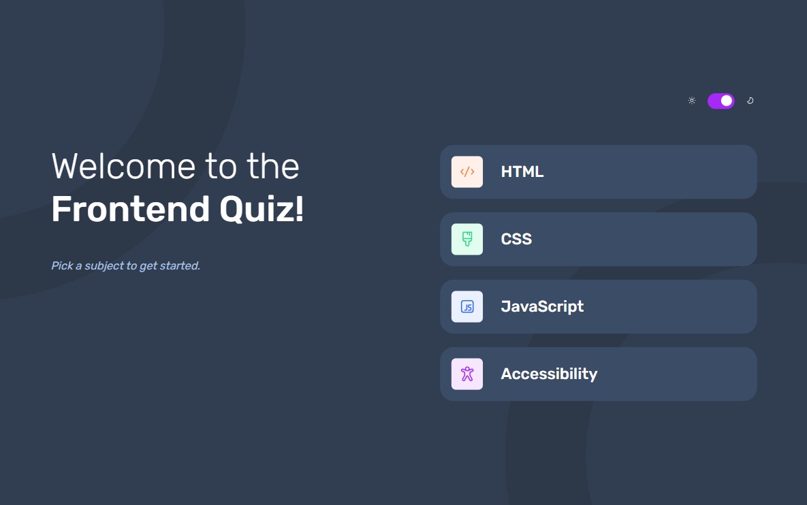

<h1 align="center">Frontend Mentor - Frontend quiz app solution</h1>

This is a solution to the <a href="https://www.frontendmentor.io/challenges/frontend-quiz-app-BE7xkzXQnU">Password generator app challenge</a> on <a href="https://www.frontendmentor.io">Frontend Mentor</a>

  <h3>
    <a href="https://srishti-quiz-app.onrender.com/">
      Live Site
    </a>
     | 
    <a href="https://github.com/itsmesrishti/fem-js-fundamentals/tree/main/frontend-quiz-app">
      Solution
    </a>
  </h3>

## Table of contents

- [Overview](#overview)
  - [The challenge](#the-challenge)
  - [Screenshot](#screenshot)
  - [Links](#links)
- [My process](#my-process)
  - [Built with](#built-with)
  - [What I learned](#what-i-learned)
- [Author](#author)
- [Acknowledgments](#acknowledgments)

## Overview

### The challenge

Users should be able to:

- Select a quiz subject
- Select a single answer from each question from a choice of four
- See an error message when trying to submit an answer without making a selection
- See if they have made a correct or incorrect choice when they submit an answer
- Move on to the next question after seeing the question result
- See a completed state with the score after the final question
- Play again to choose another subject
- View the optimal layout for the interface depending on their device's screen size
- See hover and focus states for all interactive elements on the page
- Navigate the entire app only using their keyboard
- **Bonus**: Change the app's theme between light and dark

### Screenshot

## My process

### Built with

- Semantic HTML5 markup
- CSS3
- Mobile-first workflow
- SASS/SCSS
- JavaScript
- Audio API

### What I learned

I learned how to use json files to incorporate data, hwo to work with audios, how I can make modular code using vanilla JS

## Acknowledgments

- [Render](https://render.com/) for hosting
- [Frontend Mentor](https://www.frontendmentor.io/) for the challenge

## Author

- Website: [itsmesrishti.github.io](https://{itsmesrishti.github.io/})
- GitHub: [@itsmesrishti](https://{github.com/itsmesrishti})
- Frontend Mentor - [@itsmesrishti](https://www.frontendmentor.io/profile/itsmesrishti)
- LinkedIn: [Srishti Chaudhary](https://{https://www.linkedin.com/in/srishtichaudhary/})
