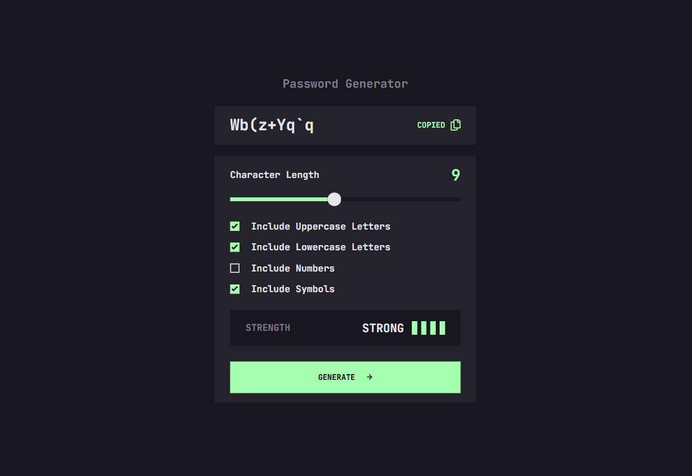

<h1 align="center">Frontend Mentor - Password generator app solution</h1>

This is a solution to the <a href="https://www.frontendmentor.io/challenges/password-generator-app-Mr8CLycqjh">Password generator app challenge</a> on <a href="https://www.frontendmentor.io">Frontend Mentor</a>

  <h3>
    <a href="https://password-generator-srishti.onrender.com/">
      Live Site
    </a>
     | 
    <a href="https://github.com/itsmesrishti/fem-js-fundamentals/tree/main/password-generator-app">
      Solution
    </a>
  </h3>

## Table of contents

- [Overview](#overview)
  - [The challenge](#the-challenge)
  - [Screenshot](#screenshot)
  - [Links](#links)
- [My process](#my-process)
  - [Built with](#built-with)
  - [What I learned](#what-i-learned)
  - [Continued development](#continued-development)
  - [Useful resources](#useful-resources)
- [Author](#author)
- [Acknowledgments](#acknowledgments)

## Overview

### The challenge

Users should be able to:

- Generate a password based on the selected inclusion options
- Copy the generated password to the computer's clipboard
- See a strength rating for their generated password
- View the optimal layout for the interface depending on their device's screen size
- See hover and focus states for all interactive elements on the page

### Screenshot

## My process

### Built with

- Semantic HTML5 markup
- CSS3
- Mobile-first workflow
- SASS/SCSS
- JavaScript
- Clipboard API

### What I learned

I learned how input range sliders can be customised, how to create random passwords, how a text can be copied using an api.

### Continued development

Currently the password strength is only being determined by the length. I want to work on it to also consider the features included in the password while determining the strength.

### Useful resources

- [How to customize sliders](https://www.sitepoint.com/css-custom-range-slider/) - This helped me customize the sliders to fit the design provided.

## Acknowledgments

- [Render](https://render.com/) for hosting
- [Frontend Mentor](https://www.frontendmentor.io/) for the challenge

## Author

- Website: [itsmesrishti.github.io](https://{itsmesrishti.github.io/})
- GitHub: [@itsmesrishti](https://{github.com/itsmesrishti})
- Frontend Mentor - [@itsmesrishti](https://www.frontendmentor.io/profile/itsmesrishti)
- LinkedIn: [Srishti Chaudhary](https://{https://www.linkedin.com/in/srishtichaudhary/})